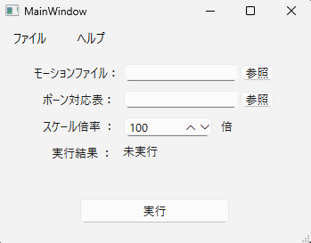

# VMD Renamer
  
### 制作者
  　天羽綺良々

## 本ツールでできること
本ツールは、vmd形式のモーションデータにあるボーン情報を書き換えるツールです。このツールにより、オリジナルのボーン命名規則のモデルにMMDモーションを適用することができます！ 

 
(左のモデル：Sour式初音ミク)

## 仕様
ツールのアプリケーションは、「VMD_Renamer」フォルダーの中の「exe」フォルダーの中に「vmdRenamerQt.exe」として同封しています。「vmdRenamerQt.exe」を起動すると、画像のようなウィンドウが出てきます。この画面で、モーションとボーン対応表のファイルを読み込み、スケール倍率を変更して実行することで、変換できます。
 

 
(ツール専用のウィンドウ) 

このツールで書き換える情報は、vmdファイル内のボーンの名前とボーンの移動量の倍率変換です。
csvファイルにボーンの対応表と倍率変換適用設定があり、お使いになるモデルなどに合わせてデフォルトで入っているcsvファイルを編集して、簡単にモーションを変換できます！ 
お使いになられるモデルに対応するボーン対応表を用意すれば、その後も使いまわせる点が便利です！

## 使い方
### 下準備
まず、画像のフォルダー(VMD_Renamer)を開き、「SampleData」というフォルダーを開いてください。その中にある「**sample.csv**」csvファイルを編集していきます。    

  
（VMD Renamerを解凍した後のフォルダー）  

**このcsvファイルの構成について：**

- **各行**: 対応させたいボーンの一覧です。例えば2行目では、モーションで「全ての親」ボーンとして登録されたキーフレームを「root」ボーンの情報として書き換えて登録できることを示しています。  
- **A列**: VMDモーション側に入っているボーン名です。基本的にこれは、MMDの命名規則に等しいです。    
- **B列**: モーションでのボーンの移動量の倍率変換するかを設定する項目です。「1」が入力された箇所は倍率変換を行い、空欄の場合は無視されます。 （注意：この「1」は、倍率変換のスケールとは関係なく、ツールを実行する際に一括で設定するので、後ほどにもその点について説明します！）    
- **C列、D列**: B列と同じく倍率変換用です。ただし、そもそも回転もサイズも倍率変換したら違う動きになりますし、そもそも現状、ツール側で移動以外の倍率変換は対応してないので、スルーでOKです。  
- **E列**: ツールで変換した後に適用するモデルでのボーン名です。MMDモーションを自分のモデルに使いたい場合は、自分のモデルのボーン名をA列と対応させて入力してください。例えば5行目を見ると、A列に「腰」、E列に「Hips」という名前が入っています。これは、vmdモーションの「腰」ボーンが「hip」ボーンに改名されることになります。 ボーン名を変更しない場合は、E列に「-」を入れてください！！   

  
（ボーン名の対応表のcsvファイル）  

### ツールの実行  
以上の下準備ができましたら、「vmdRenamerQt.exe」を起動してください。これは、「VMD_Renamerフォルダー」の中の「exe」フォルダーに存在します。 

  
（VMD Renamerを解凍した後のフォルダー）  

1. まずは、ウィンドウの「モーションファイル」の行の「参照」をクリックし、変換したいモーションのファイルを選択してください。  
2. 次に、同様に「ボーン対応表」にて、先ほど用意したボーン対応表のcsvファイルを読み込んでください！  
3. 「スケール倍率」にて、使いたい環境に合わせてモーションの移動倍率を変更してください。Blenderの環境でモーションを適用する場合は、座標の単位系によっては1倍、もしくは100倍などで対応します。  お使いのDCCツールの単位系に合わせて設定してください。  
4. 準備ができたら、「実行」をクリックして、「実行結果：変換完了」が表示されていることを確認してください。

変換後は「motionOutput」フォルダーの中に「result.vmd」としてvmdファイルが生成され、変換が完了していることが分かります。  

 
(ツール専用のウィンドウ)  

 
(変換成功時の表示)  

その後、Blenderを立ち上げて、FBXやPMXモデルを読み込み、モデルのすべてのメッシュとアーマチュアを選択し、Blenderアドオンの「MMD_tools」のモーション読み込みからresult.vmdを読み込んでみましょう！！MMDと同様に動かす場合は、足のIKセットアップが必要ですが、MMDモデルと同様のリグの形状であれば、ほとんど同等のモーションをFBXモデルでエクスポートできます！

これにて変換作業は完了です。お疲れさまでした！！    

- - -   

### 動作環境
動作確認した際の環境は以下の通りです。

デスクトップPC
- OS: Windows 11 Home
- CPU: Intel(R) Core(TM) i7-10700 CPU @ 2.90GHz   2.90 GHz
- RAM: 64GB

 

ラップトップ
- OS: Windows 11 Home
- CPU: AMD Ryzen™ 7 8840U
- RAM 32GB 

### 最終更新日
2025年4月4日

---
## 利用規約
このツールのソースコードの著作者は天羽綺良であり、この配布物を使用するにあたって、以下の事項に同意しなければならない。  

・著作者を偽っての再配布を禁止する。  
・本配布物のデータの全体または一部を複製して利用したコードの商用利用の禁止。  
・読み込むVMDファイルの制作者の利用規約を確認し、遵守すること。  
・本データの著作者は、本データを使用することで被ったいかなる損害に対して責任を負わない。  

-----------------------------------------------------------------------  

質問や要望等は以下の連絡先へ。  
mail：kirara39393@gmail.com  
